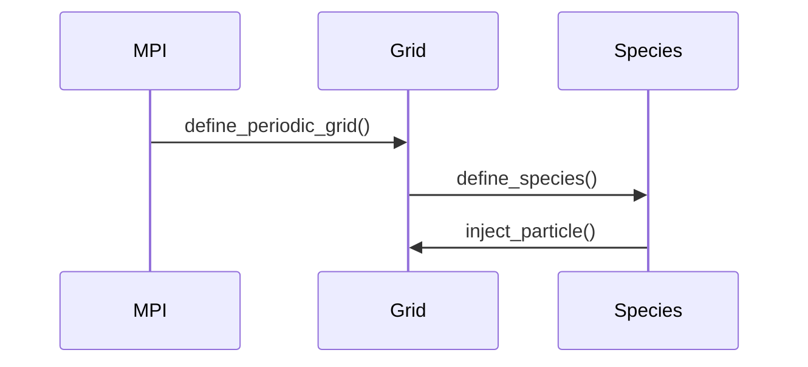

# HybridVPIC Beam-Plasma 示例架构解析

## 1. 物理模型
基于LANL实验参数的束流-等离子体相互作用模拟：
- **束流参数**：
  ```c
  double r_beam = 1e-3;     // 束流半径(m)
  double I_beam = 4000;     // 束流电流(A)
  double E_beam = 5.5e6*ec; // 束流能量(J)
  ```
- **等离子体参数**：
  ```c
  double n_plas = 1e19;    // 密度(m^-3)
  double kTe = 0.026*ec;   // 电子温度(eV)
  ```

## 2. 典型文件结构
```bash
beam_plas/
├── input.deck      # 参数配置文件
├── init.c          # 初始化例程
└── diagnostics.h   # 诊断输出配置
```

## 3. 程序架构
### 初始化流程


### 主循环控制
```c
while(step < num_step) {
    field_advance();      // 场推进
    particle_push();      // 粒子推进
    boundary_handle();    // 边界处理
    if(step%10==0) dump_diagnostics(); // 诊断输出
}
```

## 4. 边界条件系统详解

### 边界类型分类
1. **对称边界**：
   ```c
   set_domain_field_bc(BOUNDARY(-1,0,0), symmetric_fields);
   ```
   - 电场法向分量为零（E⊥=0）
   - 磁场切向分量为零（B∥=0）
   - 典型应用：金属壁面

2. **反对称边界(anti_symmetric_fields)**：
   ```c  
   set_domain_field_bc(BOUNDARY(1,0,0), anti_symmetric_fields);
   ```
   - **数学定义**：
     ```math
     \vec{B}·\hat{n}=0 \quad \text{(磁场法向分量为零)}
     \vec{E}×\hat{n}=0 \quad \text{(电场切向分量为零)}
     ```
   - **物理实现**：
     - 模拟无反射开放边界
     - 允许电磁波自由传播出计算域
     - 粒子处理通常配合`absorb_particles`
   - **典型应用**：
     - 开放空间模拟
     - 波导辐射端口
     - 等离子体与真空界面
   - **实现原理**：
     ```python
     # 伪代码实现
     def apply_anti_symmetric_boundary(field):
         field.normal_component = 0  # 法向分量归零
         field.tangential_component *= -1  # 切向分量取反
     ```
   - **与对称边界对比**：
     | 特性        | 反对称边界          | 对称边界          |
     |------------|--------------------|------------------|
     | 电场法向     | 自由变化            | 强制为零(E⊥=0)   |
     | 磁场切向     | 自由变化            | 强制为零(B∥=0)   |
     | 物理意义    | 开放边界            | 金属边界          |

3. **金属(PEC)边界**：
   ```c
   set_domain_field_bc(BOUNDARY(0,0,-1), pec_fields);
   ```
   - 完全导体边界条件
   - 电场切向分量强制为零
   - 粒子完全反射

4. **吸收边界**：
   ```c
   set_domain_field_bc(BOUNDARY(0,0,1), absorb_fields);
   set_domain_particle_bc(BOUNDARY(0,0,1), absorb_particles); 
   ```
   - 完全吸收电磁波和粒子
   - 避免数值反射

5. **特殊注入边界**：
   ```c
   set_domain_particle_bc(BOUNDARY(0,0,-1), maxwellian_reinjection);
   ```
   - 按麦克斯韦分布重新注入粒子
   - 保持边界粒子数密度

### 三维配置示例
| 维度 | 边界类型 | 场处理 | 粒子处理 | 典型应用 |
|------|----------|--------|----------|----------|
| **X** | 左 | `symmetric_fields` | `reflect_particles` | 金属侧壁 |
|      | 右 | `anti_symmetric_fields` | `absorb_particles` | 开放边界 |
| **Y** | 前 | `pec_fields` | `reflect_particles` | 波导壁面 |
|      | 后 | `absorb_fields` | `absorb_particles` | 吸收边界 |
| **Z** | 底 | `absorb_fields` | `maxwellian_reinjection` | 粒子源 |
|      | 顶 | `pec_fields` | `reflect_particles` | 金属顶盖 |

### 物理实现原理
1. **对称边界数学表达**：
   ```math
   \vec{E} \cdot \hat{n} = 0 \quad \text{(电场法向)}
   \vec{B} \times \hat{n} = 0 \quad \text{(磁场切向)}
   ```

2. **PEC边界条件**：
   ```c
   // 电场切向分量置零
   E_tangential = 0;
   // 粒子速度反向
   v_new = -v_old;
   ```

3. **吸收边界实现**：
   ```python
   # 场吸收伪代码
   def absorb_fields(field):
       return field * exp(-absorption_coeff * depth)
   ```

### 特殊案例说明
1. **波导模拟**：
   ```c
   // X方向金属壁
   set_domain_field_bc(BOUNDARY(-1,0,0), pec_fields);
   set_domain_field_bc(BOUNDARY(1,0,0), pec_fields);
   // Z方向开放端
   set_domain_field_bc(BOUNDARY(0,0,1), absorb_fields);
   ```

2. **粒子注入系统**：
   ```c
   // 底部注入边界
   set_domain_particle_bc(BOUNDARY(0,0,-1), maxwellian_reinjection);
   // 配合场吸收
   set_domain_field_bc(BOUNDARY(0,0,-1), absorb_fields);
   ```

## 5. Force-Free 磁重联实现详解

### 磁场初始化
```c
set_region_field(everywhere, 
                0, 0, 0,  // E=0
                b0*cos(alpha*z), heli*b0*sin(alpha*z), 0); // 螺旋磁场
```
**物理意义**：
1. 螺旋磁场配置：
   ```math
   \vec{B} = B_0[\cos(\alpha z)\hat{x} + h\sin(\alpha z)\hat{y}]
   ```
   - `alpha`：磁剪切参数
   - `heli`：螺旋方向（+1/-1）

2. 力自由条件验证：
   ```math
   \nabla\times\vec{B} = \alpha\vec{B}
   ```

3. 参数计算：
   ```c
   alpha = (wpe/c)*sqrt( (1/tez_texy-1) + (1/tiz_tixy-1)/mi_me );
   ```

### 粒子初始化
```c
// 在磁场局部坐标系中注入
inject_particle(ion, x,y,z,
               (-vperp1*sn + vpara*cs)/gamma,  // vx
               (vperp1*cs + vpara*sn)/gamma,   // vy 
               vperp2/gamma,                  // vz
               qi, 0, 1);
```
**关键步骤**：
1. 速度空间变换：
   - 从引导中心坐标系到实验室坐标系
   - 考虑相对论效应（gamma因子）

2. 速度分布：
   ```math
   f(v) \propto \exp\left(-\frac{v_{\parallel}^2}{2v_{t\parallel}^2}-\frac{v_{\perp}^2}{2v_{t\perp}^2}\right)
   ```

3. 参数关系：
   | 参数 | 计算公式 | 物理意义 |
   |------|---------|----------|
   | vtxye | `vdre` | 电子横向热速度 |
   | vtze | `vtxye*sqrt(tez_texy)` | 电子纵向热速度 |

### 场-粒子协同初始化
1. **匹配条件**：
   ```math
   \frac{v_{dre}}{v_A} = \frac{\alpha c}{\omega_{pe}}\frac{\omega_{ce}}{\omega_{pe}}
   ```
2. **数值实现**：
   ```c
   vdre = heli*(alpha*c/wpe)*(wce/wpe);
   vdre *= tan(0.5*alpha*lz/nz)/(0.5*alpha*lz/nz); // 网格修正
   ```

### 诊断验证
```c
// 初始场能量输出
dump_fields("fields"); 
dump_hydro("ion","ihydro");
```

### 诊断输出：
```c
global->fields_interval = 128;    // 场输出间隔
global->hydro_interval = 128;     // 流体量输出间隔
```

### 典型应用：
1. 磁重联模拟
2. 太阳日冕加热
3. 托卡马克等离子体

## 6. 诊断系统
### 输出配置
```c
global->fields_interval = 50;    // 场输出间隔
global->particle_interval = 250; // 粒子输出间隔
```

### 数据示例
```python
# 场能量分析
E_field = load_field("fields/E")
plot_energy(E_field)
```
