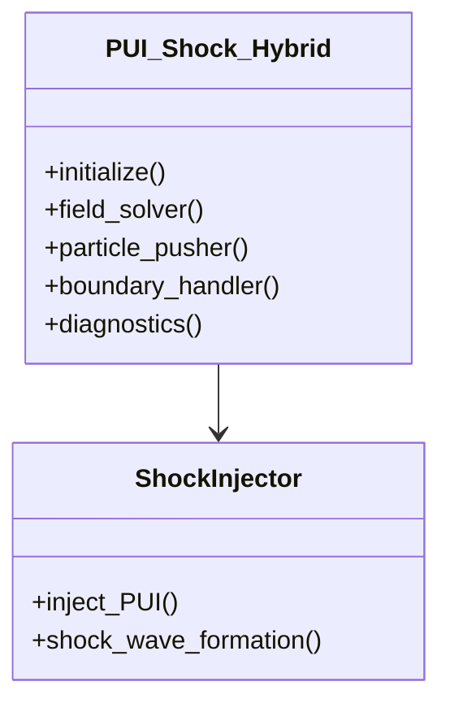
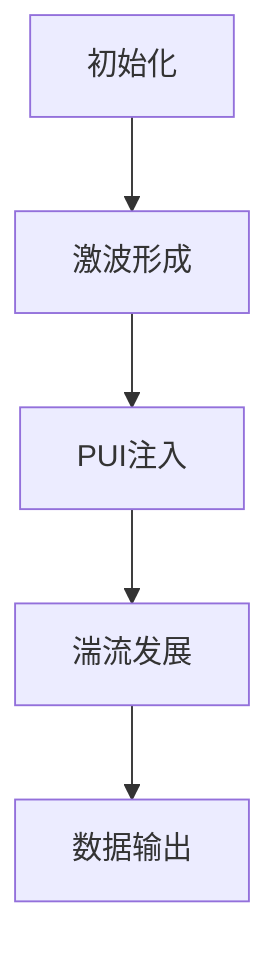

# PUI激波模拟项目文档

## 1. 项目概述
模拟太阳风中的拾起离子(PUI)与激波的相互作用，包含：
- 激波面物理过程
- 湍流产生机制
- 粒子加速过程

## 2. 核心代码文件

### 主模拟程序架构

#### 1. 核心模块


#### 2. 物理模型实现
**`PUI_shock_hyb.cxx`**:
```cpp
// 核心时间步进循环
while (step < max_step) {
    field_solver->advance();    // 场推进
    particle_pusher->push();    // 粒子推进
    shock_injector->inject();   // PUI注入
    diagnostics->record();      // 诊断输出
}
```

#### 3. 关键算法
| 算法 | 实现文件 | 数学表达 |
|------|----------|----------|
| 场推进 | `aw_field.cxx` | $\nabla\times\vec{E}=-\partial_t\vec{B}$ |
| 粒子推进 | `injection.cxx` | $\frac{d\vec{v}}{dt}=\frac{q}{m}(\vec{E}+\vec{v}\times\vec{B})$ |
| 激波注入 | `PUI_ip_shock_*.cxx` | $n_{PUI}=n_0\exp(-r/L)$ |

#### 4. 数据流设计


#### 5. 并行计算策略
- 域分解：三维笛卡尔网格分解
- MPI通信：场边界交换和粒子迁移
- 负载均衡：动态粒子权重分配

#### 6. 典型参数配置 (`conf.dat`)
```ini
[shock]
amplitude = 1.5   ; 激波强度
theta_bn = 45     ; 激波法向角(度)

[pui]
density = 0.2     ; PUI相对密度
injection_rate = 1e4 ; 注入率
```

### 粒子处理
| 文件 | 功能 |
|------|------|
| `injection.cxx` | PUI注入实现 |
| `injection_for_PUI.hh` | 注入算法头文件 |

## 3. 辅助工具

### 数据处理
| 文件 | 功能 |
|------|------|
| `ay_gda_integrate.f90` | 场数据积分工具 |
| `dumptracer_hdf5_single.cc` | 粒子轨迹输出 |
| `time_average_master.cc` | 时均数据处理 |

### 可视化
| 文件 | 功能 |
|------|------|
| `plotfigs.py` | 结果可视化脚本 |
| `translate_shock.f90` | 数据格式转换 |

## 4. 编译配置

### Makefile 配置项
```makefile
CXXFLAGS = -O3 -std=c++11
HYBRID_LIBS = -lhdf5 -lboost_system
```

### 依赖项
- HDF5 1.10+
- Boost 1.65+

## 5. 典型工作流程



## 6. 运行示例
```bash
# 编译
make -f Makefile

# 运行
./PUI_shock_hyb conf.dat
```

## 7. 结果分析
使用Python工具生成诊断图：
```python
python plotfigs.py --input=output.h5
```

## 8. 参考文献
1. Wang & Weining 2021, ApJ...
2. HybridVPIC Technical Manual
