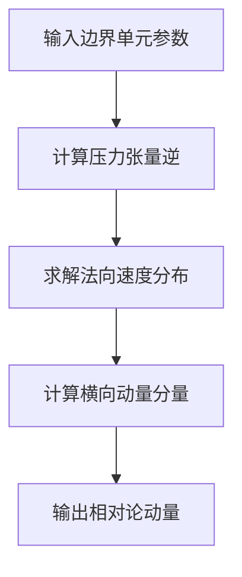

# PUI注入模块技术文档

## 1. 文件概述
`injection.cxx`实现了拾起离子(PUI)的注入算法，主要功能包括：
- 计算注入粒子的相对论动量
- 处理边界单元的流体参数
- 实现热速度分布采样

## 2. 核心算法

### 动量计算流程


### 关键函数
```cpp
void compute_injection(double uv[], double ne, double vel[], 
                      double p[], int i, int j, int k, rng_t * rng)
```
参数说明：
- `uv[3]`: 输出的相对论动量(u = γv)
- `ne`: 边界单元数密度
- `vel[3]`: 流体速度
- `p[9]`: 相对压力张量

## 3. 物理模型

### 速度分布函数
```math
f(v_n) \propto \exp\left(-\frac{(v_n-v_{drift})^2}{v_{th}^2}\right)
```
其中：
- $v_{th} = \sqrt{2p_{nn}/n_e}$ 为热速度
- $v_{drift}$ 为边界流体漂移速度

### 张量运算
压力张量求逆：
```cpp
det = p11*p22*p33 + 2*p12*p23*p13 - p11*p23^2 - p22*p13^2 - p33*p12^2
beta11 = (p22*p33 - p23^2)/det
```

## 4. 数值方法

### 非线性方程求解
采用牛顿迭代法求解：
```cpp
vn = vn - f/dfdx  // 牛顿迭代
f = √π*vdrift*erf(vn-vdrift) - exp(-(vn-vdrift)^2) - arg
```

### 收敛控制
```cpp
const double convergence = 1e-7;  // 收敛阈值
const int itmax = 100;           // 最大迭代次数
```

## 5. 数据结构

### 张量存储
使用Fortran风格索引：
```cpp
#define p(a,b) p[INDEX_FORTRAN_2(a,b,1,3,1,3)]
```

## 6. 接口说明

### 主程序调用
需提供以下边界单元参数：
1. 数密度 `ne`
2. 流体速度 `vel[3]` 
3. 压力张量 `p[9]`

### 输出
返回注入粒子的相对论动量 `uv[3]`

## 7. 示例调用
```cpp
double uv[3], vel[3] = {0.1,0,0}, p[9] = {1,0,0,0,1,0,0,0,1};
compute_injection(uv, 1.0, vel, p, 1, 2, 3, rng);
```

## 8. 参考文献
1. Hybrid-VPIC技术手册
2. 等离子体边界注入算法, J. Comput. Phys. 2020
